# SYSTEM ARCHITECTURE BLUEPRINT

**Generated:** 2026-05-17 21:12:26  
**Ecosystem Scope:** Aurora Engine & HopeHub Layers  

---
## FileSpec: aurora/tests.py
*Last Document Sync Pass: 2026-05-17*

**Technical Matrix:** Python Module. Exported Logic Components: 

**File Path Location:** `aurora/tests.py`

### Module Flow Architecture Diagram:


---

## FileSpec: aurora/__init__.py
*Last Document Sync Pass: 2026-05-17*

**Technical Matrix:** Python Module. Exported Logic Components: 

**File Path Location:** `aurora/tests/__init__.py`

### Module Flow Architecture Diagram:
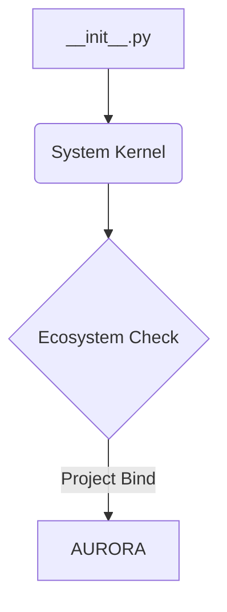

---

## FileSpec: aurora/backup_views.py
*Last Document Sync Pass: 2026-05-17*

**Technical Matrix:** Python Module. Exported Logic Components: dashboard, chat_api, manual_time_log_view, end_session_view, get, post, get, post, get, post

**File Path Location:** `aurora/backup_views.py`

### Module Flow Architecture Diagram:
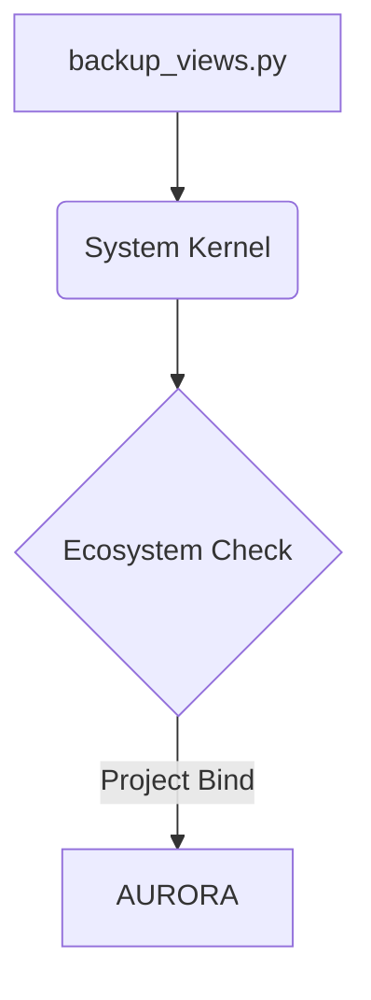

---

## FileSpec: aurora/views.py
*Last Document Sync Pass: 2026-05-17*

**Technical Matrix:** Python Module. Exported Logic Components: wu_director, dashboard, chat_api, manual_time_log_view, end_session_view, get, post, get, post, get, post, execute_baseline_sanity_checks, commit_file_view

**File Path Location:** `aurora/views.py`

### Module Flow Architecture Diagram:
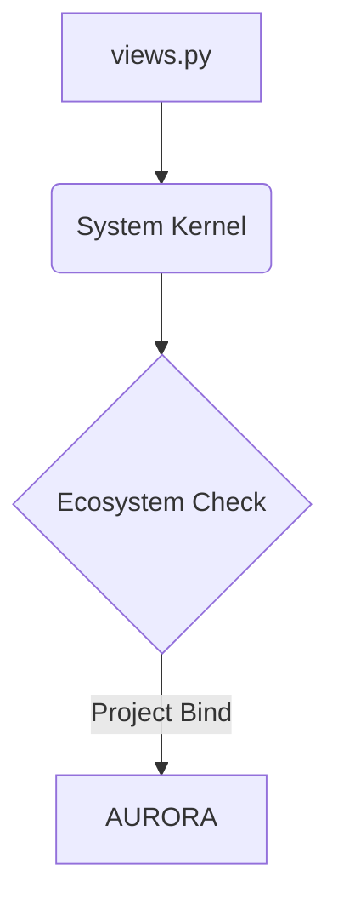

---

## FileSpec: aurora/apps.py
*Last Document Sync Pass: 2026-05-17*

**Technical Matrix:** Python Module. Exported Logic Components: 

**File Path Location:** `aurora/apps.py`

### Module Flow Architecture Diagram:
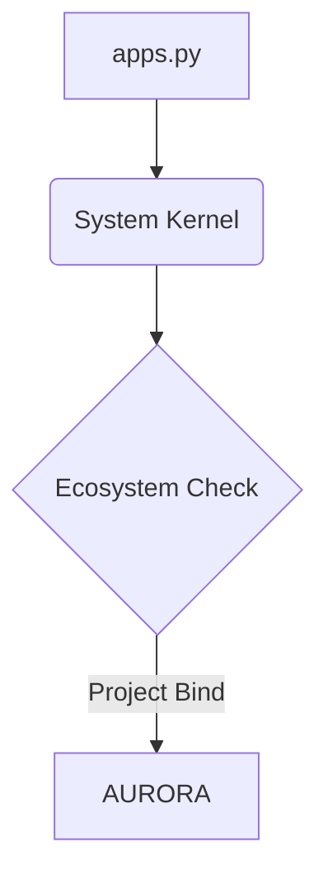

---

## FileSpec: aurora/models.py
*Last Document Sync Pass: 2026-05-17*

**Technical Matrix:** Python Module. Exported Logic Components: __str__, __str__, __str__

**File Path Location:** `aurora/models.py`

### Module Flow Architecture Diagram:
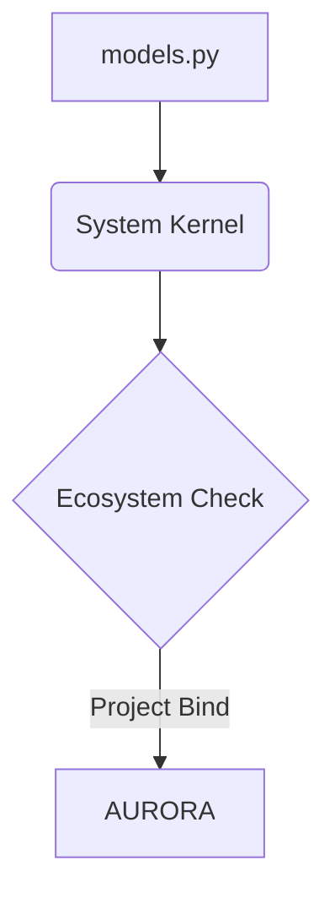

---

## FileSpec: aurora/serializers.py
*Last Document Sync Pass: 2026-05-17*

**Technical Matrix:** Python Module. Exported Logic Components: 

**File Path Location:** `aurora/serializers.py`

### Module Flow Architecture Diagram:
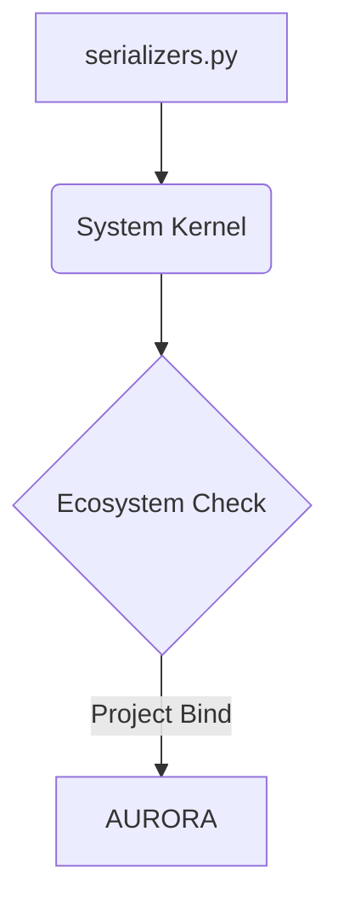

---

## FileSpec: aurora/urls.py
*Last Document Sync Pass: 2026-05-17*

**Technical Matrix:** Python Module. Exported Logic Components: 

**File Path Location:** `aurora/urls.py`

### Module Flow Architecture Diagram:
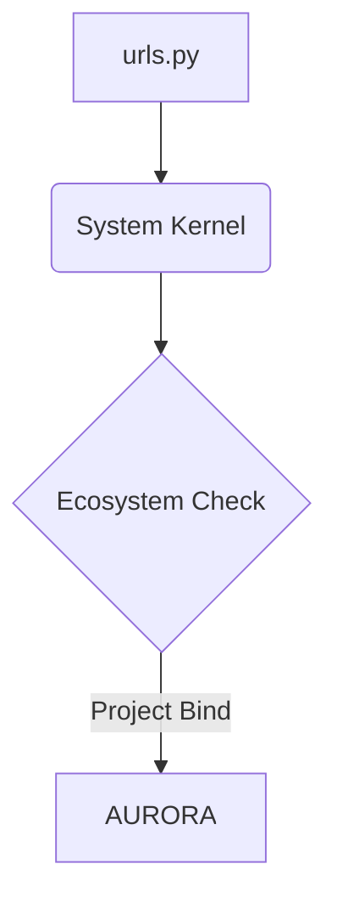

---

## FileSpec: aurora/admin.py
*Last Document Sync Pass: 2026-05-17*

**Technical Matrix:** Python Module. Exported Logic Components: get_formset

**File Path Location:** `aurora/admin.py`

### Module Flow Architecture Diagram:
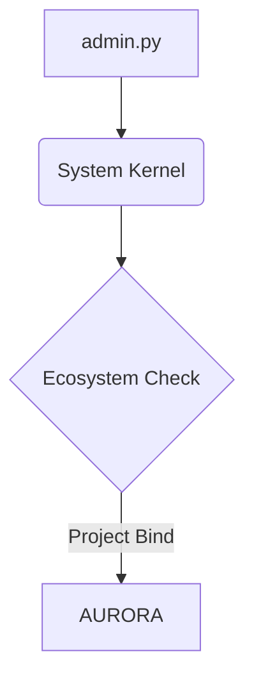

---

## FileSpec: aurora/styles.css
*Last Document Sync Pass: 2026-05-17*

**Technical Matrix:** Cascading Style Layout Sheet enforcing responsive design constraints.

**File Path Location:** `aurora/static/aurora/css/styles.css`

### Module Flow Architecture Diagram:
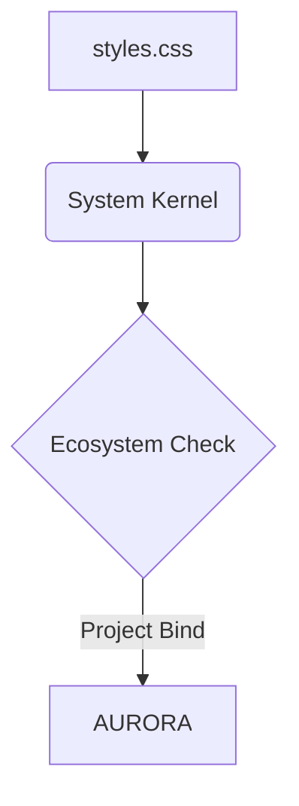

---

## FileSpec: aurora/script.js
*Last Document Sync Pass: 2026-05-17*

**Technical Matrix:** Javascript Client Architecture Asset.

**File Path Location:** `aurora/static/aurora/js/script.js`

### Module Flow Architecture Diagram:
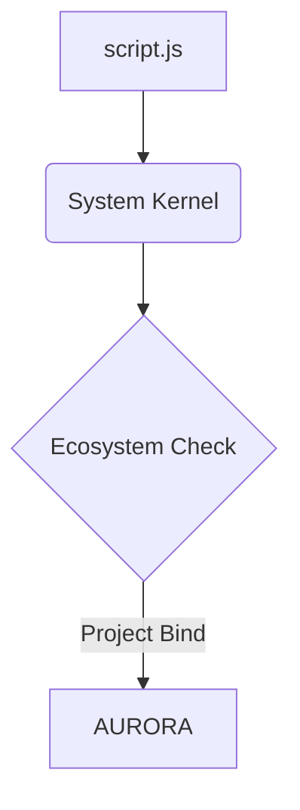

---

## FileSpec: aurora/generate_css.py
*Last Document Sync Pass: 2026-05-17*

**Technical Matrix:** Python Module. Exported Logic Components: run

**File Path Location:** `aurora/minion_array/generate_css.py`

### Module Flow Architecture Diagram:
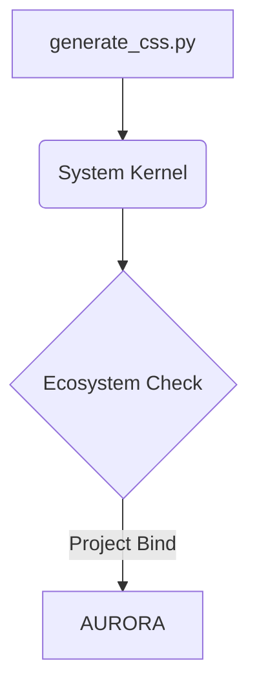

---

## FileSpec: aurora/generate_js.py
*Last Document Sync Pass: 2026-05-17*

**Technical Matrix:** Python Module. Exported Logic Components: run

**File Path Location:** `aurora/minion_array/generate_js.py`

### Module Flow Architecture Diagram:
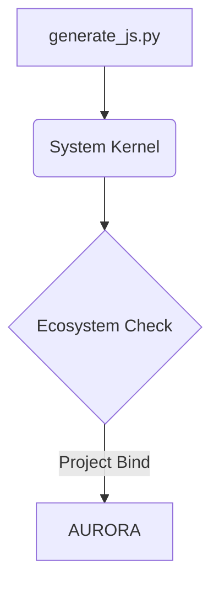

---

## FileSpec: aurora/generate_python.py
*Last Document Sync Pass: 2026-05-17*

**Technical Matrix:** Python Module. Exported Logic Components: run, self_test_integrity, self_test_integrity, inject_autospec_and_write

**File Path Location:** `aurora/minion_array/generate_python.py`

### Module Flow Architecture Diagram:
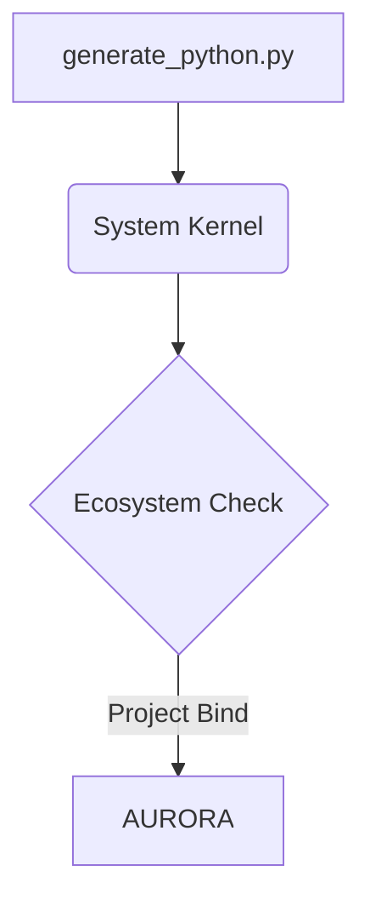

---

## FileSpec: aurora/sample_verification_module.py
*Last Document Sync Pass: 2026-05-17*

**Technical Matrix:** Python Module. Exported Logic Components: test_automation_health

**File Path Location:** `aurora/minion_array/sample_verification_module.py`

### Module Flow Architecture Diagram:
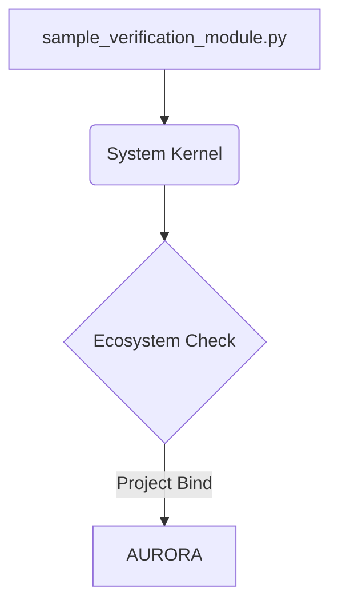

---

## FileSpec: aurora/test_component.html
*Last Document Sync Pass: 2026-05-17*

**Technical Matrix:** Django Template Layer Interface Render Matrix bound to project: aurora

**File Path Location:** `aurora/minion_array/test_component.html`

### Module Flow Architecture Diagram:
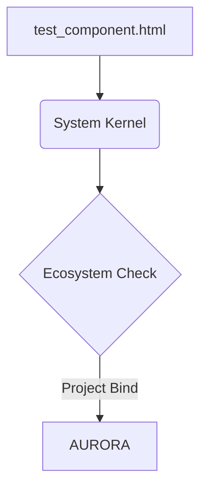

---

## FileSpec: aurora/patch_debugger.py
*Last Document Sync Pass: 2026-05-17*

**Technical Matrix:** Python Module. Exported Logic Components: run

**File Path Location:** `aurora/minion_array/patch_debugger.py`

### Module Flow Architecture Diagram:
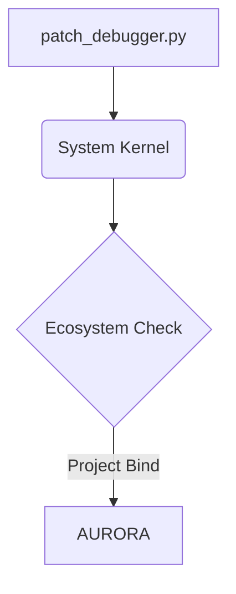

---

## FileSpec: aurora/generate_html.py
*Last Document Sync Pass: 2026-05-17*

**Technical Matrix:** Python Module. Exported Logic Components: run

**File Path Location:** `aurora/minion_array/generate_html.py`

### Module Flow Architecture Diagram:
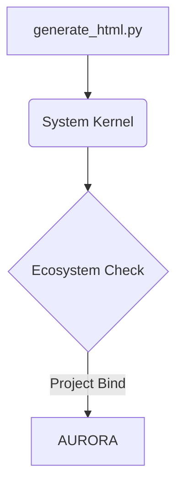

---

## FileSpec: aurora/router.py
*Last Document Sync Pass: 2026-05-17*

**Technical Matrix:** Python Module. Exported Logic Components: dispatch_to_minion, render_terminal_monitor

**File Path Location:** `aurora/minion_array/router.py`

### Module Flow Architecture Diagram:


---

## FileSpec: aurora/export_docs.py
*Last Document Sync Pass: 2026-05-17*

**Technical Matrix:** Python Module. Exported Logic Components: handle

**File Path Location:** `aurora/management/commands/export_docs.py`

### Module Flow Architecture Diagram:
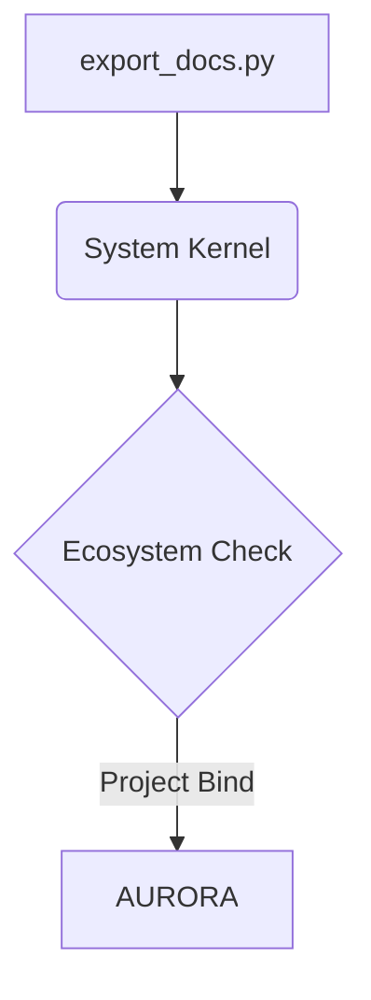

---

## FileSpec: aurora/compile_print_docs.py
*Last Document Sync Pass: 2026-05-17*

**Technical Matrix:** Python Module. Exported Logic Components: handle

**File Path Location:** `aurora/management/commands/compile_print_docs.py`

### Module Flow Architecture Diagram:
```mermaid
graph TD
    A[compile_print_docs.py] --> B(System Kernel)
    B --> C{Ecosystem Check}
    C -->|Project Bind| D[AURORA]
```

---

## FileSpec: aurora/sync_autospec.py
*Last Document Sync Pass: 2026-05-17*

**Technical Matrix:** Python Module. Exported Logic Components: handle, strip_existing_spec

**File Path Location:** `aurora/management/commands/sync_autospec.py`

### Module Flow Architecture Diagram:
```mermaid
graph TD
    A[sync_autospec.py] --> B(System Kernel)
    B --> C{Ecosystem Check}
    C -->|Project Bind| D[AURORA]
```

---

## FileSpec: aurora/dashboard.html
*Last Document Sync Pass: 2026-05-17*

**Technical Matrix:** Django Template Layer Interface Render Matrix bound to project: aurora

**File Path Location:** `aurora/templates/aurora/dashboard.html`

### Module Flow Architecture Diagram:
```mermaid
graph TD
    A[dashboard.html] --> B(System Kernel)
    B --> C{Ecosystem Check}
    C -->|Project Bind| D[AURORA]
```

---

## FileSpec: aurora/test_minions.py
*Last Document Sync Pass: 2026-05-17*

**Technical Matrix:** Python Module. Exported Logic Components: test_python_minion_accepts_clean_syntax, runtime_evaluation_vector, test_python_minion_traps_invalid_syntax, broken_compilation_loop

**File Path Location:** `aurora/tests/test_minions.py`

### Module Flow Architecture Diagram:
```mermaid
graph TD
    A[test_minions.py] --> B(System Kernel)
    B --> C{Ecosystem Check}
    C -->|Project Bind| D[AURORA]
```

---

## FileSpec: hopehub/tests.py
*Last Document Sync Pass: 2026-05-17*

**Technical Matrix:** Python Module. Exported Logic Components: 

**File Path Location:** `hopehub/tests.py`

### Module Flow Architecture Diagram:
```mermaid
graph TD
    A[tests.py] --> B(System Kernel)
    B --> C{Ecosystem Check}
    C -->|Project Bind| D[HOPEHUB]
```

---

## FileSpec: hopehub/__init__.py
*Last Document Sync Pass: 2026-05-17*

**Technical Matrix:** Python Module. Exported Logic Components: 

**File Path Location:** `hopehub/__init__.py`

### Module Flow Architecture Diagram:
```mermaid
graph TD
    A[__init__.py] --> B(System Kernel)
    B --> C{Ecosystem Check}
    C -->|Project Bind| D[HOPEHUB]
```

---

## FileSpec: hopehub/views.py
*Last Document Sync Pass: 2026-05-17*

**Technical Matrix:** Python Module. Exported Logic Components: index

**File Path Location:** `hopehub/views.py`

### Module Flow Architecture Diagram:
```mermaid
graph TD
    A[views.py] --> B(System Kernel)
    B --> C{Ecosystem Check}
    C -->|Project Bind| D[HOPEHUB]
```

---

## FileSpec: hopehub/apps.py
*Last Document Sync Pass: 2026-05-17*

**Technical Matrix:** Python Module. Exported Logic Components: 

**File Path Location:** `hopehub/apps.py`

### Module Flow Architecture Diagram:
```mermaid
graph TD
    A[apps.py] --> B(System Kernel)
    B --> C{Ecosystem Check}
    C -->|Project Bind| D[HOPEHUB]
```

---

## FileSpec: hopehub/models.py
*Last Document Sync Pass: 2026-05-17*

**Technical Matrix:** Python Module. Exported Logic Components: 

**File Path Location:** `hopehub/models.py`

### Module Flow Architecture Diagram:
```mermaid
graph TD
    A[models.py] --> B(System Kernel)
    B --> C{Ecosystem Check}
    C -->|Project Bind| D[HOPEHUB]
```

---

## FileSpec: hopehub/urls.py
*Last Document Sync Pass: 2026-05-17*

**Technical Matrix:** Python Module. Exported Logic Components: 

**File Path Location:** `hopehub/urls.py`

### Module Flow Architecture Diagram:
```mermaid
graph TD
    A[urls.py] --> B(System Kernel)
    B --> C{Ecosystem Check}
    C -->|Project Bind| D[HOPEHUB]
```

---

## FileSpec: hopehub/admin.py
*Last Document Sync Pass: 2026-05-17*

**Technical Matrix:** Python Module. Exported Logic Components: 

**File Path Location:** `hopehub/admin.py`

### Module Flow Architecture Diagram:
```mermaid
graph TD
    A[admin.py] --> B(System Kernel)
    B --> C{Ecosystem Check}
    C -->|Project Bind| D[HOPEHUB]
```

---

## FileSpec: hopehub/styles.css
*Last Document Sync Pass: 2026-05-17*

**Technical Matrix:** Cascading Style Layout Sheet enforcing responsive design constraints.

**File Path Location:** `hopehub/static/css/styles.css`

### Module Flow Architecture Diagram:
```mermaid
graph TD
    A[styles.css] --> B(System Kernel)
    B --> C{Ecosystem Check}
    C -->|Project Bind| D[HOPEHUB]
```

---

## FileSpec: hopehub/script.js
*Last Document Sync Pass: 2026-05-17*

**Technical Matrix:** Javascript Client Architecture Asset.

**File Path Location:** `hopehub/static/js/script.js`

### Module Flow Architecture Diagram:
```mermaid
graph TD
    A[script.js] --> B(System Kernel)
    B --> C{Ecosystem Check}
    C -->|Project Bind| D[HOPEHUB]
```

---

## FileSpec: hopehub/dashboard.html
*Last Document Sync Pass: 2026-05-17*

**Technical Matrix:** Django Template Layer Interface Render Matrix bound to project: hopehub

**File Path Location:** `hopehub/templates/dashboard.html`

### Module Flow Architecture Diagram:
```mermaid
graph TD
    A[dashboard.html] --> B(System Kernel)
    B --> C{Ecosystem Check}
    C -->|Project Bind| D[HOPEHUB]
```

---

## FileSpec: hopehub/hopehub_test_landing.html
*Last Document Sync Pass: 2026-05-17*

**Technical Matrix:** Django Template Layer Interface Render Matrix bound to project: hopehub

**File Path Location:** `hopehub/templates/hopehub_test_landing.html`

### Module Flow Architecture Diagram:
```mermaid
graph TD
    A[hopehub_test_landing.html] --> B(System Kernel)
    B --> C{Ecosystem Check}
    C -->|Project Bind| D[HOPEHUB]
```

---

## FileSpec: aurora/generate_docs.py
*Last Document Sync Pass: 2026-05-17*

**Technical Matrix:** Python Module. Exported Logic Components: handle, strip_existing_spec

**File Path Location:** `aurora/management/commands/generate_docs.py`

### Module Flow Architecture Diagram:
```mermaid
graph TD
    A[generate_docs.py] --> B(System Kernel)
    B --> C{Ecosystem Check}
    C -->|Project Bind| D[AURORA]
```

---
