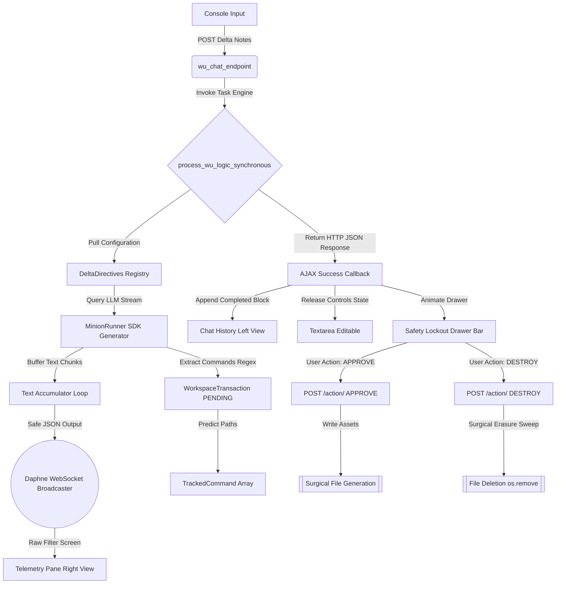

# ======================================================================
# FILE: project.md (CHUNK 1 OF 5)
# START: ARCHITECTURAL_OVERVIEW_AND_MODELS_BLUEPRINT
# ======================================================================

## 1. System Overview
This project establishes a human-in-the-loop AI orchestrator ("Wu", a 70B model) that generates operational plans and converts design intentions into structural slash-command macros (`/page`, `/api`, `/bind`). To prevent unauthorized file creation ("code run amuck"), commands are stored as pending relational tracking database rows first. The human review panel can then authorize file execution or execute a total surgical rollback (`/destroy`).

## 2. Process Flow Diagram


## 3. Database Schema Blueprint (`aurora/models.py`)
```python
# aurora/models.py (PATCH 6 OF 6)
# START: AUTOMATION_APPROVALS_TRACKING_SCHEMA
import uuid
from django.db import models
from django.contrib.auth.models import User

class WorkspaceTransaction(models.Model):
    """Tracks a cluster of slash commands generated by an orchestrator session."""
    STATUS_CHOICES = [
        ('PENDING', 'Pending Developer Review'),
        ('EXECUTED', 'Executed and Locked'),
        ('ROLLED_BACK', 'Destroyed and Rolled Back'),
        ('REJECTED', 'Rejected by User')
    ]
    id = models.UUIDField(primary_key=True, default=uuid.uuid4, editable=False)
    user = models.ForeignKey(User, on_delete=models.CASCADE, related_name='workspace_transactions')
    prompt_context = models.TextField(help_text="The original delta_notes that triggered this request.")
    status = models.CharField(max_length=20, choices=STATUS_CHOICES, default='PENDING')
    date_created = models.DateTimeField(auto_now_add=True)
    date_modified = models.DateTimeField(auto_now=True)

    def __str__(self):
        return f"Transaction #{self.id} ({self.status}) - {self.user.username}"


class TrackedCommand(models.Model):
    """Surgically details individual slash commands and logs the file paths they touched."""
    id = models.UUIDField(primary_key=True, default=uuid.uuid4, editable=False)
    transaction = models.ForeignKey(WorkspaceTransaction, on_delete=models.CASCADE, related_name='commands')
    macro = models.CharField(max_length=50, help_text="e.g., /page, /api, /bind")
    arguments = models.JSONField(help_text="Array of string variables passed to the handler.")
    affected_files = models.JSONField(default=list, help_text="List of file paths created or mutated.")
    execution_order = models.PositiveIntegerField(default=0)

    class Meta:
        ordering = ['execution_order']

    def __str__(self):
        return f"{self.macro} {' '.join(self.arguments)} [Tx #{self.transaction.id}]"
```
# ======================================================================
# END: ARCHITECTURAL_OVERVIEW_AND_MODELS_BLUEPRINT (CHUNK 1 OF 5)
# ======================================================================

# ======================================================================
# FILE: project.md (CHUNK 2 OF 5)
# START: BACKEND_ORCHESTRATION_CORE_ENGINE
# ======================================================================

## 4. Backend Processing Engine (`aurora/api/wu_chat_api.py`)

```python
# aurora/api/wu_chat_api.py (PATCH 1-2 OF 4)
import json
import asyncio
import traceback
import re
import sys
import os
from django.http import JsonResponse
from django.contrib.auth.decorators import login_required
from django.conf import settings
from asgiref.sync import sync_to_async, async_to_sync
from aurora.models import DeltaDirectives, WorkspaceTransaction, TrackedCommand
from aurora.minions.engine import MinionRunner
from .dev_streamer_api import async_send_to_console

def process_wu_logic_synchronous(user_delta_notes, user):
    """Generates the full Groq execution plan and records pending tracking blocks."""
    try:
        runner = MinionRunner()
        try:
            wu_config = DeltaDirectives.objects.get(directive_name="minion_wu", is_active=True)
        except DeltaDirectives.DoesNotExist:
            error_msg = "💥 [REGISTRY CRITICAL]: Master directive configuration 'minion_wu' is missing or inactive!"
            sys.stderr.write(f"{error_msg}\n")
            sys.stderr.flush()
            return {"status": "ERROR", "message": "Master orchestrator missing.", "trace": error_msg}

        complete_response_text = ""
        stream_generator = runner.run_minion_task_stream("minion_wu", user_delta_notes)

        async def consume_stream():
            nonlocal complete_response_text
            async for token in stream_generator:
                complete_response_text += token
                # sys.stdout writes are removed here to prevent telemetry channel capacity log-flooding

        async_to_sync(consume_stream)()

        transaction = WorkspaceTransaction.objects.create(
            user=user,
            prompt_context=user_delta_notes,
            status='PENDING'
        )

        command_blocks = re.findall(r"\[COMMAND:\s*(.*?)\]", complete_response_text)
        for index, command_string in enumerate(command_blocks):
            parts = command_string.strip().split()
            if not parts:
                continue
            
            macro = parts[0].lower().strip()
            predicted_files = []
            clean_arg = parts[1].strip().lower().replace(" ", "_") if len(parts) >= 2 else ""
            if macro == "/page":
                predicted_files.append(f"aurora/templates/aurora/pages/{clean_arg}.html")
            elif macro == "/api":
                predicted_files.append(f"aurora/api/{clean_arg}_api.py")

            TrackedCommand.objects.create(
                transaction=transaction,
                macro=macro,
                arguments=parts[1:],
                affected_files=predicted_files,
                execution_order=index
            )

        return {"status": "SUCCESS", "wu_response": complete_response_text, "transaction_id": str(transaction.id)}
    except Exception as err:
        return {"status": "ERROR", "message": str(err), "trace": traceback.format_exc()}
```
# ======================================================================
# END: BACKEND_ORCHESTRATION_CORE_ENGINE (CHUNK 2 OF 5)
# ======================================================================

# ======================================================================
# FILE: project.md (CHUNK 3 OF 5)
# START: VIEW_ENDPOINTS_AND_URL_ROUTING_BLUEPRINT
# ======================================================================

## 5. View Controllers & Routing (`aurora/api/wu_chat_api.py` Continued)

```python
# aurora/api/wu_chat_api.py (PATCH 3-4 OF 4)
@login_required
def wu_chat_endpoint(request):
    """Processes requests, returning text alongside a unique transaction review token ID."""
    if request.method == "POST":
        try:
            data = json.loads(request.body)
            delta_notes = data.get("delta_notes", "").strip()
            if not delta_notes:
                return JsonResponse({"error": "Empty delta notes provided"}, status=400)
            result = process_wu_logic_synchronous(delta_notes, request.user)
            if result["status"] == "ERROR":
                return JsonResponse({"error": result["message"], "traceback": result["trace"]}, status=500)
            return JsonResponse({"status": "wu_is_processing", "direct_text_output": result["wu_response"], "transaction_id": result["transaction_id"]})
        except Exception as err:
            return JsonResponse({"error": str(err)}, status=400)
    return JsonResponse({"error": "POST required"}, status=405)

@login_required
def process_transaction_action(request, tx_id):
    """Approve or surgically Rollback (/destroy) workspace changes by transaction tracking ID."""
    if request.method != "POST":
        return JsonResponse({"error": "POST required"}, status=405)
        
    def _execute_sync_action_logic():
        try:
            tx = WorkspaceTransaction.objects.prefetch_related('commands').get(id=tx_id, user=request.user)
            action = json.loads(request.body).get("action", "").upper()

            if action == "APPROVE":
                from aurora.minions.automation_utilities import WorkspaceAutomationRunner
                runner = WorkspaceAutomationRunner(user=request.user, dry_run=False)
                for cmd in tx.commands.all():
                    if cmd.macro == "/page" and cmd.arguments:
                        async_to_sync(runner.execute_page_command)(cmd.arguments)
                    elif cmd.macro == "/api" and cmd.arguments:
                        async_to_sync(runner.execute_api_command)(cmd.arguments)
                tx.status = 'EXECUTED'
                tx.save()
                return {"status": "SUCCESS", "message": "Transaction executed and files written."}

            elif action == "DESTROY":
                for cmd in tx.commands.all():
                    for file_path in cmd.affected_files:
                        full_path = os.path.join(getattr(settings, "BASE_DIR", os.getcwd()), file_path)
                        if os.path.exists(full_path):
                            os.remove(full_path)
                tx.status = 'ROLLED_BACK'
                tx.save()
                return {"status": "SUCCESS", "message": "Transaction files destroyed and configuration rolled back."}

            return {"error": "Invalid action context", "status_code": 400}
        except WorkspaceTransaction.DoesNotExist:
            return {"error": "Transaction context lookup failure.", "status_code": 404}
        except Exception as err:
            return {"error": str(err), "status_code": 500}

    try:
        loop = asyncio.get_running_loop()
        is_async_context = True
    except RuntimeError:
        is_async_context = False

    if is_async_context:
        async def run_in_thread():
            return await sync_to_async(_execute_sync_action_logic, thread_sensitive=False)()
        result = async_to_sync(run_in_thread)()
    else:
        result = _execute_sync_action_logic()
    
    if "error" in result:
        return JsonResponse({"error": result["error"]}, status=result.get("status_code", 400))
    return JsonResponse(result)
```

## 6. System Dispatch Mappings (`aurora/urls.py`)
```python
# aurora/urls.py (PATCH 1 OF 1)
from django.urls import path
from aurora import api as api_commands

urlpatterns = [
    # ... previous routes ...
    path('api/wu_chat/', api_commands.wu_chat_endpoint, name='wu_chat_endpoint'),
    path('api/transaction/<uuid:tx_id>/action/', api_commands.process_transaction_action, name='process_transaction_action'),
]
```
# ======================================================================
# END: VIEW_ENDPOINTS_AND_URL_ROUTING_BLUEPRINT (CHUNK 3 OF 5)
# ======================================================================

# ======================================================================
# FILE: project.md (CHUNK 4 OF 5)
# START: FRONTEND_COCKPIT_SNIPPETS_AND_LAYERS
# ======================================================================

## 7. Split Layout Cockpit Panel (`aurora/templates/aurora/snippets/wu_chat_console_panel.html`)

```html
<!-- aurora/templates/aurora/snippets/wu_chat_console_panel.html (PATCH 1 OF 1) -->
<div class="d-flex flex-column h-100 w-100" style="box-sizing: border-box; min-height: 0; background-color: #000000;">
  
  <!-- Top Section: Core Split Interaction Working Grid Matrix -->
  <div class="d-flex flex-row flex-grow-1 gap-2 style-container" style="min-height: 0; padding-bottom: 4px;">
    
    <!-- LEFT PANEL: Chat Input Deck for Commander Wu (66.66% Proportions Layout) -->
    <div class="d-flex flex-column h-100" style="width: 66.66%; min-width: 0; padding-right: 4px;">
      <div class="d-flex justify-content-between align-items-center mb-1">
        <span class="text-uppercase font-weight-bold font-monospace text-warning small" style="letter-spacing: 1px;">💬 Command Input Deck: Wu (70B Orchestrator)</span>
      </div>
      
      <!-- Scrollable message log canvas rendering dialog bubble nodes -->
      <div id="wu-chat-history-log" class="flex-grow-1 p-2 rounded mb-2 d-flex flex-column gap-2" style="background-color: #050506; border: 1px solid #1f1f23; overflow-y: auto; min-height: 0;">
        <div class="text-muted font-monospace small px-2 py-1 align-self-center rounded bg-dark border border-secondary" style="font-size: 0.75rem;">
          Secure sub-space link active. Transmit instructions to engage the minion fleet.
        </div>
      </div>

      <!-- Modified text input deck strictly for human intentions drafting -->
      <div class="d-flex flex-column gap-2" style="height: 120px; shrink: 0;">
        <textarea id="wu-human-delta-notes-input" class="form-control h-100 p-2 font-monospace" style="background-color: #070708; border: 1px solid #1f1f23; color: #f4f4f5; font-size: 0.85rem; resize: none;" placeholder="Input human design intentions (Delta Notes) to request an orchestral strategy break-down..."></textarea>
        <button id="transmit-to-wu-btn" class="btn btn-primary btn-sm font-monospace fw-bold text-uppercase w-100 py-2" style="background-color: #1e3a8a; border: 1px solid #2563eb; color: #f8fafc; font-size: 0.8rem; letter-spacing: 1px;">Transmit to Commander Wu</button>
      </div>
    </div>

    <!-- RIGHT PANEL: Real-Time Stream Telemetry Console (33.33% Proportions Layout) -->
    <div class="d-flex flex-column h-100" style="width: 33.33%; min-width: 0; border-left: 1px solid #1f1f23; padding-left: 8px;">
      <div class="d-flex justify-content-between align-items-center mb-1">
        <span class="text-uppercase font-weight-bold font-monospace text-muted small" style="letter-spacing: 1px; color: #888888;">📡 Fleet Telemetry Output Stream</span>
        <button id="clear-wu-telemetry-btn" class="btn btn-outline-secondary btn-xs py-0 px-2 font-monospace" style="font-size: 0.7rem; border-color: #27272a; color: #a3a3a3;">Flush Logs</button>
      </div>
      <div id="wu-telemetry-screen-output" class="flex-grow-1 p-2 rounded" style="background-color: #050505; border: 1px solid #1f1f23; overflow-y: auto; font-family: ui-monospace, SFMono-Regular, Consolas, monospace; font-size: 0.85rem; line-height: 1.4; color: #a3a3a3;">
        <div class="text-info font-monospace small">[SYSTEM] Telemetry pipeline deck initialized...</div>
      </div>
    </div>

  </div>

  <!-- Safety Verification Gate Drawer block at the bottom of the cockpit template layout canvas -->
  <div id="wu-pending-transaction-drawer" class="d-none p-2 mt-1 rounded animate-fade-in" style="background-color: #09090b; border: 1px solid #27272a; font-family: monospace;">
    <div class="d-flex justify-content-between align-items-center">
      <div class="d-flex flex-column">
        <span class="text-uppercase text-danger fw-bold small" style="letter-spacing: 1px;">⚠️ Safety Gating Lockout Enabled</span>
        <span class="text-muted small" style="font-size: 0.75rem;">Orchestrator returned commands. Awaiting authorization before mutating local project files.</span>
      </div>
      <div class="d-flex gap-2">
        <button id="wu-action-approve-btn" class="btn btn-success btn-xs font-monospace font-weight-bold text-uppercase px-3 py-1" style="font-size: 0.75rem;">Approve and Write</button>
        <button id="wu-action-destroy-btn" class="btn btn-danger btn-xs font-monospace font-weight-bold text-uppercase px-3 py-1" style="font-size: 0.75rem;">Destroy / Rollback</button>
      </div>
    </div>
  </div>

</div>
```
# ======================================================================
# END: FRONTEND_COCKPIT_SNIPPETS_AND_LAYERS (CHUNK 4 OF 5)
# ======================================================================

# ======================================================================
# FILE: project.md (CHUNK 5 OF 5)
# START: BROWSER_STREAMING_CONTROLLER_SCRIPTS
# ======================================================================

## 8. Client Interaction Logic Engine (`aurora/static/aurora/js/wu_chat.js`)

```javascript
// aurora/static/aurora/js/wu_chat.js (PATCH 1-3 OF 3)
function initWuChatConsole(endpoints, csrfToken) {
  const inputField = ('#wu-human-delta-notes-input');
  const transmitBtn = ('#transmit-to-wu-btn');
  const telemetryLog = ('#wu-telemetry-screen-output');
  const chatHistory = ('#wu-chat-history-log');
  
  const approvalDrawer = ('#wu-pending-transaction-drawer');
  const approveBtn = ('#wu-action-approve-btn');
  const destroyBtn = ('#wu-action-destroy-btn');
  
  let activeTransactionId = null;
  let \$currentWuBubble = null;

  if (!\$transmitBtn.length) return;

  function handleIncomingStreamData(rawData) {
    let rawStringContent = "";

    if (typeof rawData === 'object' && rawData !== null) {
      rawStringContent = JSON.stringify(rawData);
    } else if (typeof rawData === 'string') {
      rawStringContent = rawData.trim();
    }

    // Intercept structured json tokens via substring matching to handle ambient channel data noise
    if (rawStringContent.includes('"event":') || rawStringContent.includes('wu_chat_')) {
      try {
        if (rawStringContent.includes('wu_chat_complete')) {
          appendSystemAlert('📡 [SYSTEM]: Orchestrator response transaction complete.');
          \$currentWuBubble = null;
          resetInputControls();
          return;
        }

        const tokenMatch = rawStringContent.match(/"text"\s*:\s*"(.*?)"/);
        if (tokenMatch && tokenMatch[1]) {
          const processedText = tokenMatch[1].replace(/\\n/g, '\n').replace(/\\t/g, '\t');
          
          if (!\$currentWuBubble) {
            currentWuBubble = ('<div class="p-2 rounded font-monospace small text-light" style="background-color: #1e1b4b; border: 1px solid #312e81; align-self: flex-start; max-width: 85%; white-space: pre-wrap;"><strong>Wu: </strong></div>');
            chatHistory.append(currentWuBubble);
          }
          \$currentWuBubble.append(document.createTextNode(processedText));
          chatHistory.scrollTop(chatHistory[0].scrollHeight);
          return;
        }
      } catch (innerErr) {}
    }

    // Standard log terminal streaming fallback filter
    if (rawStringContent.trim() && !rawStringContent.includes('"event":')) {
      const lineNode = ('<div style="margin-bottom: 2px; color: #a3a3a3;"></div>').text(rawStringContent);
      telemetryLog.append(lineNode);
      telemetryLog.scrollTop(telemetryLog[0].scrollHeight);
    }
  }

  \$(document).on('aurora:telemetry_stream_received', function(event, data) {
    handleIncomingStreamData(data);
  });

  if (window.telemetrySocket) {
    window.telemetrySocket.onmessage = function(e) {
      handleIncomingStreamData(e.data);
    };
  }

  \$transmitBtn.on('click', function(e) {
    e.preventDefault();
    const deltaNotesText = \$inputField.val().trim();
    if (!deltaNotesText) {
      appendSystemAlert('[WARNING] Cannot transmit blank design intentions.');
      return;
    }

    \$approvalDrawer.addClass('d-none');
    activeTransactionId = null;

    const userBubble = ('<div class="p-2 rounded font-monospace small text-light" style="background-color: #18181b; border: 1px solid #27272a; align-self: flex-end; max-width: 85%; white-space: pre-wrap;"></div>').text(deltaNotesText);
    chatHistory.append(userBubble);
    chatHistory.scrollTop(chatHistory[0].scrollHeight);

    \(inputField.val('').prop('disabled', true);\)transmitBtn.prop('disabled', true).text('PROCESSING STRATEGY LOOP...');
    appendSystemAlert('🚀 [SYSTEM] Transmitting design intentions to Commander Wu...');

    \$.ajax({
      url: endpoints.wu_chat_endpoint,
      method: 'POST',
      contentType: 'application/json',
      data: JSON.stringify({ delta_notes: deltaNotesText }),
      headers: { 'X-CSRFToken': csrfToken },
      success: function(response) {
        if (response.status === 'wu_is_processing') {
          const finalOutputText = response.direct_text_output || "No explicit response text returned.";
          const wuBubble = ('<div class="p-2 rounded font-monospace small text-light" style="background-color: #1e1b4b; border: 1px solid #312e81; align-self: flex-start; max-width: 85%; white-space: pre-wrap;"><strong>Wu: </strong></div>');
          \$wuBubble.append(document.createTextNode(finalOutputText));
          chatHistory.append(wuBubble);
          chatHistory.scrollTop(chatHistory[0].scrollHeight);
          
          if (response.transaction_id) {
            activeTransactionId = response.transaction_id;
            \$approvalDrawer.removeClass('d-none');
            appendSystemAlert('⚠️ [SAFETY GATE] Orchestration completed. Awaiting file modification permissions...');
          }
        } else {
          appendSystemAlert(`💥 [SYSTEM ERROR] Unexpected response status: ${response.status}`);
        }
        resetInputControls();
      },
      error: function(xhr) {
        let errorText = 'Unknown API Fault.';
        try {
          const parsed = JSON.parse(xhr.responseText);
          errorText = parsed.error || errorText;
        } catch(e) {}
        appendSystemAlert(`💥 [SYSTEM ERROR] Fault response: ${errorText}`);
        resetInputControls();
      }
    });
  });

  \$approveBtn.on('click', function() {
    executeTransactionAction('APPROVE', '🛠️ [SYSTEM] Authorizing file creation scripts...');
  });

  \$destroyBtn.on('click', function() {
    executeTransactionAction('DESTROY', '🛑 [SYSTEM] Triggering surgical asset rollback execution sequence...');
  });

  function executeTransactionAction(actionName, systemLogMessage) {
    if (!activeTransactionId) return;
    
    appendSystemAlert(systemLogMessage);
    \$approvalDrawer.addClass('d-none');

    const actionUrl = `/aurora/api/transaction/${activeTransactionId}/action/`;

    \$.ajax({
      url: actionUrl,
      method: 'POST',
      contentType: 'application/json',
      data: JSON.stringify({ action: actionName }),
      headers: { 'X-CSRFToken': csrfToken },
      success: function(response) {
        if (response.status === 'SUCCESS') {
          appendSystemAlert(`✅ [ACTION SUCCESS]: ${response.message}`);
        } else {
          appendSystemAlert(`💥 [ACTION FAULT]: Request failed context response.`);
        }
        resetInputControls();
      },
      error: function(xhr) {
        appendSystemAlert('💥 [ACTION FAULT]: Error communicating with verification endpoint nodes.');
        resetInputControls();
      }
    });
  }

  function resetInputControls() {
    \(transmitBtn.prop('disabled', false).text('Transmit to Commander Wu');\)inputField.prop('disabled', false).val('').focus();
  }

  function appendSystemAlert(message) {
    const lineNode = ('<div style="margin-bottom: 4px; color: #38bdf8;"></div>').text(message);
    telemetryLog.append(lineNode);
    telemetryLog.scrollTop(telemetryLog[0].scrollHeight);
  }

  \$(document).on('aurora:telemetry_stream_ended', function() {
    resetInputControls();
  });
}
```
# ======================================================================
# END: BROWSER_STREAMING_CONTROLLER_SCRIPTS (CHUNK 5 OF 5)
# ======================================================================
