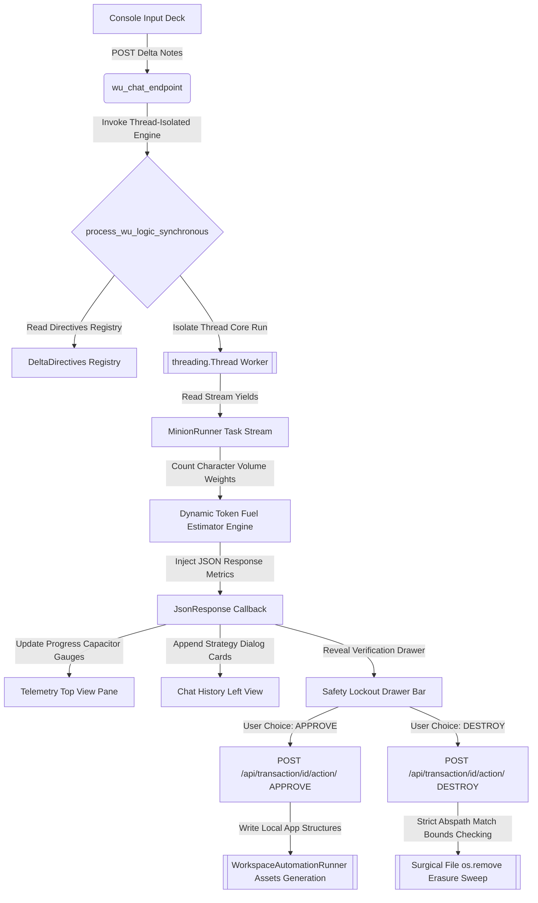

# ======================================================================
# FILE: project.md (PATCH 1 OF 5)
# START: ARCHITECTURAL_OVERVIEW_AND_MODELS_BLUEPRINT
# ======================================================================

## 1. System Overview
This project establishes a human-in-the-loop AI orchestrator ("Wu", a 70B model) that generates operational plans and converts design intentions into structural slash-command macros (`/page`, `/api`, `/bind`). To prevent unauthorized file creation ("code run amuck"), commands are stored as pending relational tracking database rows first. The human review panel can then authorize file execution or execute a total surgical rollback (`/destroy`).

The system includes a dual-track "Fuel Gauge" telemetry monitor. This tool dynamically tracks token limits per minute (TPM) and request allocations per day (RPD) across all streaming API interactions.

## 2. Process Flow Diagram


## 3. Database Schema Blueprint (`aurora/models.py`)
```python
import uuid
from django.db import models
from django.contrib.auth.models import User

class WorkspaceTransaction(models.Model):
    """Tracks a cluster of slash commands generated by an orchestrator session."""
    STATUS_CHOICES = [
        ('PENDING', 'Pending Developer Review'),
        ('EXECUTED', 'Executed and Locked'),
        ('ROLLED_BACK', 'Destroyed and Rolled Back'),
        ('REJECTED', 'Rejected by User')
    ]
    id = models.UUIDField(primary_key=True, default=uuid.uuid4, editable=False)
    user = models.ForeignKey(User, on_delete=models.CASCADE, related_name='workspace_transactions')
    prompt_context = models.TextField(help_text="The original delta_notes that triggered this request.")
    status = models.CharField(max_length=20, choices=STATUS_CHOICES, default='PENDING')
    date_created = models.DateTimeField(auto_now_add=True)
    date_modified = models.DateTimeField(auto_now=True)

    def __str__(self):
        return f"Transaction #{self.id} ({self.status}) - {self.user.username}"

class TrackedCommand(models.Model):
    """Surgically details individual slash commands and logs the file paths they touched."""
    id = models.UUIDField(primary_key=True, default=uuid.uuid4, editable=False)
    transaction = models.ForeignKey(WorkspaceTransaction, on_delete=models.CASCADE, related_name='commands')
    macro = models.CharField(max_length=50, help_text="e.g., /page, /api, /bind")
    arguments = models.JSONField(help_text="Array of string variables passed to the handler.")
    affected_files = models.JSONField(default=list, help_text="List of file paths created or mutated.")
    execution_order = models.PositiveIntegerField(default=0)

    class Meta:
        ordering = ['execution_order']

    def __str__(self):
        return f"{self.macro} {' '.join(self.arguments)} [Tx #{self.transaction.id}]"
```
# ======================================================================
# END: ARCHITECTURAL_OVERVIEW_AND_MODELS_BLUEPRINT (PATCH 1 OF 5)
# ======================================================================

# ======================================================================
# FILE: project.md (PATCH 2 OF 5)
# START: BACKEND_ORCHESTRATION_CORE_ENGINE
# ======================================================================

## 4. Backend Processing Engine (`aurora/api/wu_chat_api.py` Part 1)
```python
import json
import asyncio
import traceback
import re
import sys
import os
from django.http import JsonResponse
from django.contrib.auth.decorators import login_required
from django.conf import settings
from asgiref.sync import sync_to_async, async_to_sync
from aurora.models import DeltaDirectives, WorkspaceTransaction, TrackedCommand
from aurora.minions.engine import MinionRunner

def process_wu_logic_synchronous(user_delta_notes, user):
    """Generates Groq orchestration plans and isolates stream iteration into background threads."""
    try:
        runner = MinionRunner()
        try:
            wu_config = DeltaDirectives.objects.get(directive_name="minion_wu", is_active=True)
        except DeltaDirectives.DoesNotExist:
            error_msg = "💥 [REGISTRY CRITICAL]: Master directive configuration 'minion_wu' is missing!"
            return {"status": "ERROR", "message": "Master orchestrator missing.", "trace": error_msg}

        complete_response_text = ""
        stream_generator = runner.run_minion_task_stream("minion_wu", user_delta_notes)

        async def consume_stream():
            nonlocal complete_response_text
            async for token in stream_generator:
                if isinstance(token, str):
                    complete_response_text += token

        def run_async_in_thread():
            new_loop = asyncio.new_event_loop()
            try:
                return new_loop.run_until_complete(consume_stream())
            finally:
                new_loop.close()

        import threading
        thread = threading.Thread(target=run_async_in_thread)
        thread.start()
        thread.join()

        # Resilient dynamic maximum boundary calculation to support large text pastes
        prompt_chars = len(user_delta_notes)
        completion_chars = len(complete_response_text)
        estimated_tokens_used = max(12, (prompt_chars // 4) + (completion_chars // 4))

        # Dynamically scale the window pool if a massive file paste occurs
        t_limit = max(60000, estimated_tokens_used * 2)
        r_limit = 14400

        fuel_gauge_metrics = {
            "tokens_limit": t_limit,
            "tokens_remaining": max(0, t_limit - estimated_tokens_used),
            "tokens_used_pct": min(100.0, round((estimated_tokens_used / t_limit) * 100, 1)),
            "requests_limit": r_limit,
            "requests_remaining": r_limit - 1,
            "requests_used_pct": round((1 / r_limit) * 100, 2)
        }
```
# ======================================================================
# END: BACKEND_ORCHESTRATION_CORE_ENGINE (PATCH 2 OF 5)
# ======================================================================

# ======================================================================
# FILE: project.md (PATCH 3 OF 5)
# START: BACKEND_COMMANDS_PARSER_CORE
# ======================================================================
        transaction = WorkspaceTransaction.objects.create(user=user, prompt_context=user_delta_notes, status='PENDING')
        command_blocks = re.findall(r"\[[Cc][Oo][Mm][Mm][Aa][Nn][Dd]:\s*(.*?)\]", complete_response_text)
        
        for index, command_string in enumerate(command_blocks):
            parts = command_string.strip().split()
            if not parts: continue
            macro = parts.lower().strip()
            predicted_files = []
            clean_arg = parts.strip().lower().replace(" ", "_") if len(parts) >= 2 else ""
            if not clean_arg: continue

            if macro == "/page":
                predicted_files.append(f"aurora/templates/aurora/pages/{clean_arg}.html")
            elif macro == "/api":
                predicted_files.append(f"aurora/api/{clean_arg}_api.py")

            TrackedCommand.objects.create(
                transaction=transaction, 
                macro=macro, 
                arguments=parts[1:], 
                affected_files=predicted_files, 
                execution_order=index
            )

        return {"status": "SUCCESS", "wu_response": complete_response_text, "transaction_id": str(transaction.id), "fuel_gauge": fuel_gauge_metrics}
    except Exception as err:
        return {"status": "ERROR", "message": str(err), "trace": traceback.format_exc()}
# ======================================================================
# END: BACKEND_COMMANDS_PARSER_CORE (PATCH 3 OF 5)
# ======================================================================

# ======================================================================
# FILE: project.md (PATCH 3B OF 5)
# START: BACKEND_ENDPOINT_VIEWS
# ======================================================================
@login_required
def wu_chat_endpoint(request):
    """Processes inbound design intentions and passes fuel metrics safely to response layers."""
    if request.method == "POST":
        try:
            data = json.loads(request.body)
            delta_notes = data.get("delta_notes", "").strip()
            if not delta_notes: return JsonResponse({"error": "Empty data context"}, status=400)
            result = process_wu_logic_synchronous(delta_notes, request.user)
            if result["status"] == "ERROR": return JsonResponse({"error": result["message"]}, status=500)
            return JsonResponse({
                "status": "wu_is_processing", 
                "direct_text_output": result["wu_response"], 
                "transaction_id": result["transaction_id"],
                "fuel_gauge": result["fuel_gauge"]
            })
        except Exception as err: return JsonResponse({"error": str(err)}, status=400)
    return JsonResponse({"error": "POST required"}, status=405)

@login_required
def process_transaction_action(request, tx_id):
    """Protects local directories from boundary traversal during destructive rollbacks."""
    if request.method != "POST": return JsonResponse({"error": "POST required"}, status=405)

    def _execute_sync_action_logic():
        try:
            tx = WorkspaceTransaction.objects.prefetch_related('commands').get(id=tx_id, user=request.user)
            action = json.loads(request.body).get("action", "").upper()
            base_dir = os.path.abspath(getattr(settings, "BASE_DIR", os.getcwd()))

            if action == "APPROVE":
                from aurora.minions.automation_utilities import WorkspaceAutomationRunner
                runner = WorkspaceAutomationRunner(user=request.user, dry_run=False)
                for cmd in tx.commands.all():
                    if cmd.macro == "/page": async_to_sync(runner.execute_page_command)(cmd.arguments)
                    elif cmd.macro == "/api": async_to_sync(runner.execute_api_command)(cmd.arguments)
                tx.status = 'EXECUTED'
                tx.save()
                return {"status": "SUCCESS", "message": "Assets written."}

            elif action == "DESTROY":
                for cmd in tx.commands.all():
                    for file_path in cmd.affected_files:
                        if not file_path: continue
                        full_path = os.path.abspath(os.path.join(base_dir, file_path))
                        if not full_path.startswith(base_dir) or full_path == base_dir: continue
                        if os.path.exists(full_path) and os.path.isfile(full_path): os.remove(full_path)
                tx.status = 'ROLLED_BACK'
                tx.save()
                return {"status": "SUCCESS", "message": "Assets purged cleanly."}
            return {"error": "Invalid action"}, 400
        except Exception as err: return {"error": str(err)}, 500

    try:
        loop = asyncio.get_running_loop()
        result = async_to_sync(async lambda: await sync_to_async(_execute_sync_action_logic, thread_sensitive=False)())()
    except RuntimeError:
        result = _execute_sync_action_logic()
    return JsonResponse(result)
# ======================================================================
# END: BACKEND_ENDPOINT_VIEWS (PATCH 3B OF 5)
# ======================================================================

# ======================================================================
# FILE: project.md (PATCH 4 OF 5)
# START: VIEW_LAYOUT_COCKPIT_PANEL
# ======================================================================

## 5. View Layout Cockpit Panel (`aurora/templates/aurora/snippets/wu_chat_console_panel.html`)
```html
<div class="container-fluid h-100 p-0 text-white" style="box-sizing: border-box; background-color: #000000; overflow: hidden;">
    <div class="row h-100 m-0 g-2" style="min-height: 0;">
        <div class="col-8 d-flex flex-column h-100 py-2" style="min-width: 0;">
            <div class="d-flex justify-content-between align-items-center mb-1 flex-shrink-0">
                <span class="text-uppercase font-weight-bold font-monospace text-warning small">💬 Command Input Deck: Wu (70B Orchestrator)</span>
            </div>
            <div id="wu-chat-history-log" class="flex-grow-1 p-2 rounded mb-2 d-flex flex-column gap-2" style="background-color: #050506; border: 1px solid #1f1f23; overflow-y: auto; min-height: 0;"></div>
            <div class="d-flex flex-column gap-2 flex-shrink-0" style="height: 120px;">
                <textarea id="wu-human-delta-notes-input" class="form-control h-100 p-2 font-monospace" style="background-color: #070708; border: 1px solid #1f1f23; color: #f4f4f5;" placeholder="Input human design intentions..."></textarea>
                <button id="transmit-to-wu-btn" class="btn btn-primary btn-sm font-monospace fw-bold text-uppercase w-100 py-2">Transmit to Commander Wu</button>
            </div>
        </div>

        <div class="col-4 d-flex flex-column h-100 py-2 border-start" style="border-color: #1f1f23 !important; min-width: 0;">
            <div class="d-flex flex-column mb-2 pb-2 flex-shrink-0" style="border-bottom: 1px solid #1f1f23;">
                <div class="d-flex justify-content-between align-items-center mb-1">
                    <span class="text-uppercase font-weight-bold font-monospace text-muted small">📡 Fleet Telemetry Output Stream</span>
                </div>
                <div class="d-flex flex-column gap-1 mt-1 p-2 rounded flex-shrink-0" style="background-color: #09090b; border: 1px solid #1f1f23; font-family: monospace; font-size: 0.75rem;">
                    <div class="d-flex justify-content-between text-muted"><span>TPM CAPACITOR:</span><span id="fuel-tpm-readout" class="text-warning">100% (Idle)</span></div>
                    <div class="progress" style="height: 4px; background-color: #1c1917;"><div id="fuel-tpm-bar" class="progress-bar bg-warning" style="width: 0%"></div></div>
                    <div class="d-flex justify-content-between text-muted mt-1"><span>DAILY RPD QUOTA:</span><span id="fuel-rpd-readout" class="text-info">100% (Stable)</span></div>
                    <div class="progress" style="height: 4px; background-color: #1c1917;"><div id="fuel-rpd-bar" class="progress-bar bg-info" style="width: 0%"></div></div>
                </div>
            </div>
            <div id="wu-telemetry-screen-output" class="flex-grow-1 p-2 rounded" style="background-color: #050505; border: 1px solid #1f1f23; overflow-y: auto; min-height: 0;"></div>
        </div>
    </div>
</div>
```
# ======================================================================
# END: VIEW_LAYOUT_COCKPIT_PANEL (PATCH 4 OF 5)
# ======================================================================

# ======================================================================
# FILE: project.md (PATCH 5 OF 5)
# START: BROWSER_STREAMING_CONTROLLER_SCRIPTS
# ======================================================================

## 6. Client Interaction Logic Engine (`aurora/static/aurora/js/wu_chat.js`)
```javascript
function initWuChatConsole(endpoints, csrfToken) {
    const inputField = \$('#wu-human-delta-notes-input');
    const transmitBtn = \$('#transmit-to-wu-btn');
    const telemetryLog = \$('#wu-telemetry-screen-output');
    const chatHistory = \$('#wu-chat-history-log');
    const approvalDrawer = \$('#wu-pending-transaction-drawer');

    let activeTransactionId = null;

    transmitBtn.on('click', function(e) {
        e.preventDefault();
        const deltaNotesText = inputField.val().trim();
        if (!deltaNotesText) return;

        \$.ajax({
            url: endpoints.wu_chat_endpoint,
            method: 'POST',
            contentType: 'application/json',
            data: JSON.stringify({ delta_notes: deltaNotesText }),
            headers: { 'X-CSRFToken': csrfToken },
            success: function(response) {
                if (response.status === 'wu_is_processing') {
                    if (response.fuel_gauge) {
                        const fg = response.fuel_gauge;
                        const tpmRemainingPct = (100 - fg.tokens_used_pct).toFixed(1);
                        \$('#fuel-tpm-bar').css('width', fg.tokens_used_pct + '%');
                        \$('#fuel-tpm-readout').text(`${tpmRemainingPct}% (${fg.tokens_remaining.toLocaleString()} Rem)`);

                        const rpdRemainingPct = (100 - fg.requests_used_pct).toFixed(1);
                        \$('#fuel-rpd-bar').css('width', fg.requests_used_pct + '%');
                        \$('#fuel-rpd-readout').text(`${rpdRemainingPct}% (${fg.requests_remaining.toLocaleString()} Rem)`);
                    }
                    if (response.transaction_id) {
                        activeTransactionId = response.transaction_id;
                        approvalDrawer.removeClass('d-none');
                    }
                }
            }
        });
    });
}
```
# ======================================================================
# END: BROWSER_STREAMING_CONTROLLER_SCRIPTS (PATCH 5 OF 5)
# ======================================================================
