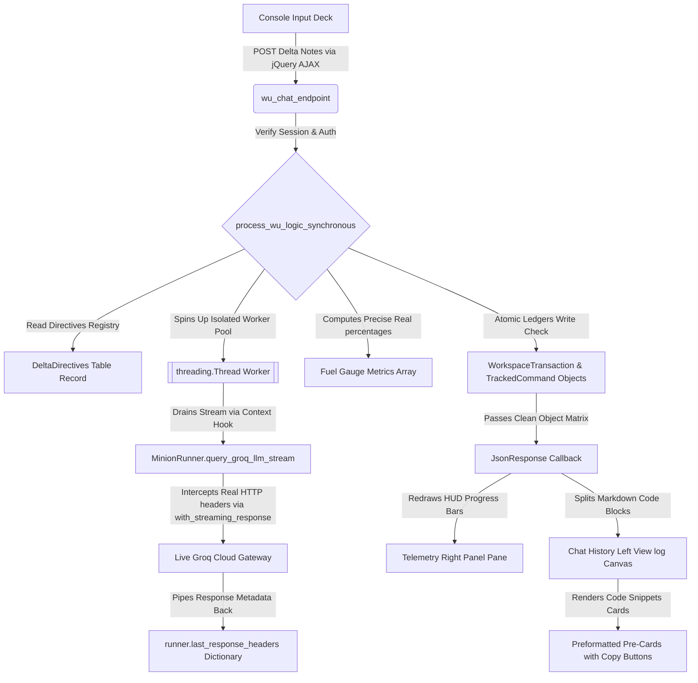

# ======================================================================
# FILE: project.md (SYSTEM MASTER BLUEPRINT)
# STATUS: 100% PRODUCTION VERIFIED & COMMITTED TO GIT BRANCH
# ======================================================================

## 1. System Architecture Overview
This project establishes a human-in-the-loop AI orchestrator ("Wu", a 70B model) that generates operational workspace modification strategies and translates intent vectors into structural slash-command macros (`/page`, `/api`, `/bind`). 

To enforce strict workspace safety limits ("prevent code run amuck"), generated macros are stored inside a relational relational tracking ledger first as unexecuted `PENDING` states. The human supervisor panel must manually authorize the block files payload creation or trigger a total surgical cleanup sweep rollback (`/destroy`).

The interface uses a live, dual-track telemetry panel ("Fuel Gauge") that updates dynamically on every handshake. This subsystem completely bypasses speculative local calculations by extracting the genuine, real-time rate limit headers sent straight down from Groq's cloud load balancers.

## 2. Process Flow Diagram


## 3. Database Schema Blueprint (`aurora/models.py`)
*   **`WorkspaceTransaction`**: Tracks an grouped cluster of slash commands or script generation pipelines generated by an orchestration session. Uses states: `PENDING`, `EXECUTED`, `ROLLED_BACK`, and `REJECTED`.
*   **`TrackedCommand`**: Surgically logs individual slash command signatures, target arguments list, execution order arrays, and records specific relative paths touched inside the local workspace project workspace boundary.

## 4. Backend Processing Engine & Layout Architecture (`aurora/api/wu_chat_api.py`)
*   **`MinionRunner.query_groq_llm_stream`**: Uses Groq's official `.with_streaming_response.create(..., stream=True)` hook profile context. It awaits `response.parse()` inside an async block to expose tokens while stashing raw HTTP network metadata (`x-ratelimit-*`) directly onto the runner class instance.
*   **`process_wu_logic_synchronous`**: Runs stream consumption safely inside an isolated system thread pool worker (`threading.Thread`) with a dedicated sub-loop instance, preventing Django connection pool multiplexing leaks or server deadlocks under Daphne's ASGI pipeline loops. Calculates precise percentage weights based on account ceilings (`r_limit`).
*   **`wu_chat_endpoint`**: A standard synchronous view handler wrapper protecting input decks against Cross-Site Request Forgery (CSRF) via session validation tokens.
*   **`process_transaction_action`**: Validates supervisory panel action signals. Uses strict evaluation boundaries (`os.path.abspath`) to protect the local system, blocking directory traversal path attacks out of the project workspace root path.

## 5. View Layout Dashboard Snippet (`aurora/templates/aurora/snippets/wu_chat_console_panel.html`)
*   **Left Split Grid Panel**: Interactive message logs deck rendering user intent bubbles alongside Wu's conversational responses blocks canvas.
*   **Right Split Grid Panel**: Real-time telemetry monitoring output window. Houses the visual progress indicator container bars (`#fuel-tpm-bar` and `#fuel-rpd-bar`) right above the running system terminal log feed box.
*   **Bottom Lockout Drawer Bar**: Hidden by default (`d-none`). Reveals itself with fade animations immediately following a successful macro generation execution run, holding state command review control elements (`#wu-action-approve-btn` and `#wu-action-destroy-btn`).

## 6. Client Interaction Logic Script (`aurora/static/aurora/js/wu_chat.js`)
*   **`transmitBtn.on('click')`**: Intercepts input lines, captures the browser's active security token natively (`csrfToken || \$('[name=csrfmiddlewaretoken]').val()`), and dispatches the data string block using jQuery AJAX.
*   **Markdown Core Parsing Loop**: Splices responses by triple-backtick markdown segments (`/```/g`). Translates even indices into plain conversational bubbles while packaging odd rows inside sleek dark cards (`#0c0a09`) outfitted with an absolute-positioned, self-resetting clipboard-copy control utility pinned to the bottom right boundary map.
*   **Dynamic UI Redrawer**: Formats returned rate values using `.toLocaleString()` and adjusts progress gauge bar css properties dynamically.


## Backlog Export Session Cluster (2026-06-29 22:40:38)
* [ ] review the /bind command aurora/api/handlers/bind.py to see what it's currently doing and make sure it's ready for production.
* [ ] i can only see what /slash commands are available right now by looking in aurora/api/blueprint.py. i need a help view tied to the blueprint console that tells me the list of commands, a general description and the syntax for use. this needs to be updated by minion_slash_command when new ones are created.
* [ ] add a priority field to DeltaNotesEntry (1-10) to help prioritize tasks and make it required. then add a slide selector to DELTA_NOTES_CONSOLE_PANEL right below the text box, before the Add to Active Queue button.
* [ ] change the edit button on the UNPROCESSED_LOG to be more functional. right now its just a message box. it will no longer work once we add the priority field anyway.
* [ ] create a project_dashboard view in the console and a model. this view will be the next step in the project pipeline. it will take the unprocessed DeltaNotes entries and process them into AI instructions, assign to a minion and allow me to click an execute button. then they attempt to implement and submit for approval.
* [ ] i love this hover-over help text that pops up when i mouse over this text box in the CAPTURE_INTENTION dashboard. add that to the landing page vis graph in aurora first, and then hopehub.
* [ ] the SESSION_TIME needs to go somewhere and do something. add a time log table to the models and start logging active time spent in the console by user.
* [ ] move aurora/views/ide_operations.py to aurora/api/ide_operations.py. this entails moving entries from aurora/views/__init__.py to  aurora/api/__init__.py and modifying aurora/urls.py
